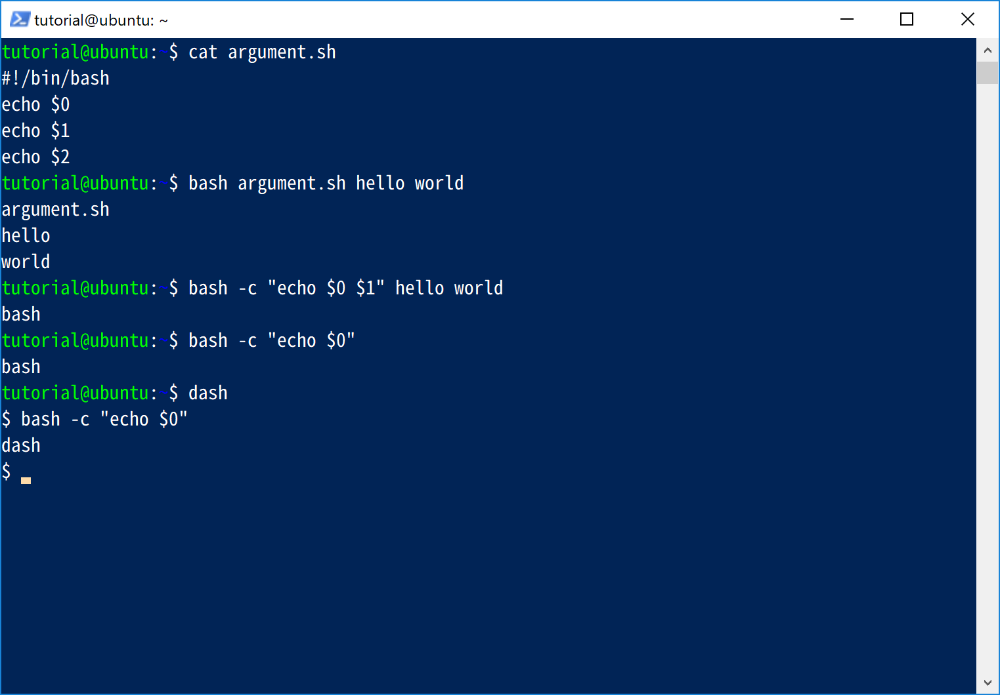
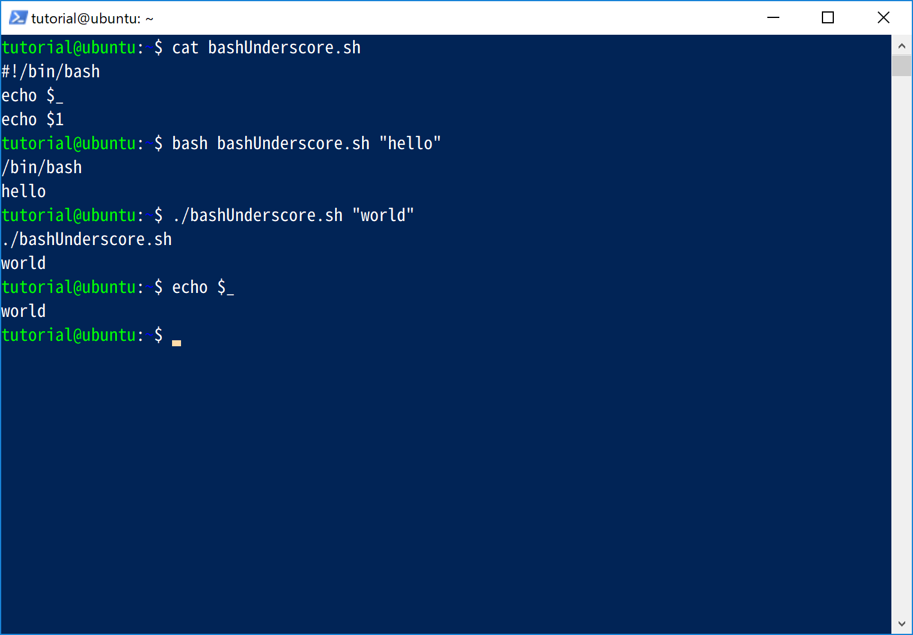

# 🔰BashShellをさわってみる

Windowsしかさわらない人生だったので名前くらいしか聞いたことないBashシェルをさわってみる。

## 🔰そもそもBashとはなんぞや

もともとはGNUオペレーシングシステムのシェル・コマンド言語インタープリタとして誕生。
Unixの**Bourne Shell(sh)**を参考に、GNUプロジェクトがその代替となるものとして作成された。

ちなみにBashは**Bourne-Again SHell**の略語。

歴史的経緯は色々あるようだけれど、今現在では色々なLinuxディストリビューションだったりmacOSの標準シェルとして採用されている。

## 🔰ドキュメント

GNUのページにBashのリファレンスがある。

[GNU Bash manual](https://www.gnu.org/software/bash/manual/)

あとss64.comにあるBashのページがまとまってて見やすい気がする。

[SS64.com - Bash](https://ss64.com/bash/)

## 🔰今回色々試す環境

Ubuntu Server 16.04.4 LTS (Xenial Xerus)にPowershell + [openSSH](https://github.com/PowerShell/Win32-OpenSSH)で接続している。

- Powershellのバージョンは5.1.16299.251
- openSSHのバージョンはOpenSSH_for_Windows_7.6p1, LibreSSL 2.6.4
- UbuntuServerのホスト名がubuntu
- UbuntuServerで利用するユーザ名はtutorial


## 🔰helloworld

とりあえず基本のhelloworld。

`echo`コマンドでコンソールに文字列を表示する事ができるので、これを利用してhelloworldを表示する。


## 🔰Bashのメタキャラクタ

リファレンスの中に下記のように記載がある。

>A character that, when unquoted, separates words. A metacharacter is a space, tab, newline, or one of the following characters: ‘|’, ‘&’, ‘;’, ‘(’, ‘)’, ‘<’, or ‘>’.

- `|`
- `&`
- `;`
- `(`
- `)`
- `<`
- `>`

## 🔰Shell Syntax

### 🔰EscapeChara `\`

Bashでは引用符で囲まれていないbackslash `\`がエスケープ文字。

### 🔰Single Quotes `'`

BashではsingleQuotesで囲まれた中をリテラルとして保持する。

### 🔰double Quotes `"`

- BashではdoubleQuotesで囲まれた範囲について`$(dollar)`,&#96;grave accent,`\backSlash`を除いてリテラルとして保持する。
- Bashのヒストリ展開が有効の場合は`! exclamation`も除く。

ざっくりとはこんな感じだが、他にも細かい条件が色々あるが割愛。

詳細は下記参照

[GNU-bash-doubleQuotes](https://www.gnu.org/software/bash/manual/bash.html#Double-Quotes)

### 🔰ANSI-C Quoting

Bashでは$'string'という形式でC言語のエスケープシーケンスを利用できる。

string   | description
:------- | :----------------------------
`\a`     | ベル文字
`\b`     | バックスペース
`\e`     | エスケープ文字
`\E`     | エスケープ文字
`\f`     | 改ページ文字
`\n`     | 改行文字
`\r`     | キャリッジリターン
`\t`     | 水平タブ
`\v`     | 垂直タブ
`\\`     | バックスラッシュ
`\'`     | singule quote
`\"`     | double quote
`\?`     | question mark
`\nnn`   | 8進数でASCIIコードを指定する
`\xHH`   | 16進数でASCIIコードを指定する
`\uHHHH` | 16進数でUnicode文字を指定する

## 🔰Brace Expansion

ブレース展開は任意の文字列を生成する。

`{}`で括った中に色々な記法で記述を行う事により、様々な文字列に展開される。

色々あるので詳細は下記を参照

[gnu - Brace Expansion](https://www.gnu.org/software/bash/manual/bash.html#Brace-Expansion)


## 🔰Tilde Expansion

Bashではtilde ~は下記のように展開される。

tildeExpansion | description
:------------- | :----------------------------------------------------------
`~`            | The value of $HOME
`~/foo`        | $HOME/foo
`~fred/foo`    | The subdirectory foo of the home directory of the user fred
`~+/foo`       | $PWD/foo
`~-/foo`       | ${OLDPWD-'~-'}/foo
`~N`           | The string that would be displayed by ‘dirs +N’
`~+N`          | The string that would be displayed by ‘dirs +N’
`~-N`          | The string that would be displayed by ‘dirs -N’

## 🔰Comments

Bashでは行頭に`#`が存在すると以降のコマンドを無視します。

行頭`#`でコメントとして扱う  


## 🔰Shell Scripts

コンソールで入力を行い実行するだけではなく、ファイルにスクリプトを記述し実行する事も出来ます。

下記のように`bash`にscriptFileを引き渡して実行する。

`bash scriptFile`

もしくはファイルの実行権限があれば下記のような記述でも実行できます。

`./scriptFile`

今回は**helloworld.sh**というファイルを作成して実行してみる。

```bash
#!/bin/bash
echo "hello world"
```

今回は**vim**エディタを利用してファイル作成。  


ちなみに`cat`コマンドでファイルの内容を表示できる。

`cat helloworld.sh`で作成したファイルを表示  


`bash scriptName`で実行するケース

`bash helloworld.sh`  


実行権限をつけて`./screiptName`で実行するケース  


## 🔰shibang

Helloworldのスクリプトファイルで一行目に記載した`#!/bin/bash`は**shebang**。

**shebang**は何のアプリケーションで実行すればよいか指定するおまじない。

**shebang**は一行目に`#!実行するアプリケーションのフルパス`という形式で記載する。

今回はBashなので`#!/bin/bash`という具合。

アプリケーションのフルパスを記述するのではなく下記のように。

`/use/bin/env bash`

`env`が環境変数を指定してアプリを実行する機能を利用して間接的に指定する方法もある。

ちなみにubuntuの場合、`#!/bin/sh`は**dash(Debian Almquist shel)**にリンクが張っているようです。

ubuntuはshはdashにリンクがはってある  


なので**shebang**を`#!/bin/sh`として`./scriptName`という記述で実行すると**dashシェル**で実行されます。

## 🔰シェルパラメータ(シェル変数)

### 🔰文字列変数の定義

Bashでは`name=[value]`でシェルパラメータを定義する。ビルトインコマンドの`declare`でも同様にシェルパラメータを定義できる。

定義したシェルパラメータには`$name`というように定義名に`$`を付与すれ事でアクセスできる。
もしくはビルトインコマンドの`declare -p name`という記述でアクセスすることも出来る。

なおBashシェルでは変数名の大文字小文字は区別されて別物として扱われます。

ありがちな失敗としては`=`の前後に空白を入れたりするとエラーになります。

- **greeting**という変数を定義して**hello world**を代入
- **GREETING**という変数を定義して**HELLO WORLD**を代入
- 定義した変数を`echo`コマンドで表示
- 定義した変数を`declare -p`コマンドで表示


定義したシェルパラメータを削除するには`unset`コマンドを利用する。


### 🔰数値変数の定義

シェルパラメータを数値として定義するには`declare -i`を利用する。


### 🔰配列変数の定義

シェルパラメータを配列として定義する場合は`name=(value value value)`もしくは`declare -a name=(value value value)`を利用する。

配列の要素にアクセスするには`${name[index]}`というようにする。


すべての要素を展開する場合は`${name[*]}`もしくは`${name[@]}`を利用する。
`*`と`@`の場合でdouble quotesで括った場合に多少動作が異なるので注意。(後述)

配列の要素数を取得する場合は`${#name[*]}`もしくは`${#name[@]}`


### 🔰配列の展開時に`*`と`@`で異なる動作について

>If the subscript is ‘@’ or ‘*’, the word expands to all members of the array name.
>These subscripts differ only when the word appears within double quotes.
>If the word is double-quoted,
>${name[*]} expands to a single word with the value of each array member separated by the first character of the IFS variable,
>and ${name[@]} expands each element of name to a separate word.
>When there are no array members, ${name[@]} expands to nothing.
>If the double-quoted expansion occurs within a word,
>the expansion of the first parameter is joined with the beginning part of the original word,
>and the expansion of the last parameter is joined with the last part of the original word.
>This is analogous to the expansion of the special parameters ‘@’ and ‘*’.
>${#name[subscript]} expands to the length of ${name[subscript]}. If subscript is ‘@’ or ‘*’, the expansion is the number of elements in the array.

Bash Reference Manualに上記のように書いてあるので試してみる。

ちなみに**IFS**は**Internal Field Separator**の略語。

IFSは特別なシェルパラメータでBashでは設定がなければデフォルトは`<space><tab><newline>`を区切り文字として扱う。

ここでは配列arrayを`("one" "two" "three four five")`

```bash
array[0]="one"
array[1]="two"
array[2]="thee four five"
```

という感じに宣言して、それぞれ`*`と`@`で展開してasterisk配列とatmark配列に代入している。

この時注目するのは配列にアクセスする際に`"${array[*]}"`、`"${array[@]}"`のようにdouble quotesでくくってアクセスしている点。

このようにアクセスする場合、`*`と`@`では下記のように動作に違いがでてくる。

- `*`アスタリスクの場合は単一の要素に展開する。
- `@`アットマークの場合は元々の配列の各要素を展開する。


なおdouble quotesで括らない場合は両者共にIFSを加味して下記の用に展開される。


### 🔰シェルパラメータのスコープ

シェルパラメータのスコープは該当プロセス中のみ有効。

### 🔰シェルパラメータの一覧表示

シェルパラメータの一覧を表示するには、`declare`コマンドもしくは`set`コマンドを利用する。

ただし、シェルパラメータ以外にも後述する環境変数も表示されます。

`declare`コマンドで一覧表示  


### 🔰特別なシェルパラメータ

#### 🔰`$0`

Bashがコマンドファイル（シェルスクリプト）から呼び出された場合はファイル名が入ります。

また`$1,$2,$3,$4,$5,$6,$7,$8,$9`はスクリプトファイルに指定した引数が入ります。

`bash`コマンドに`-c`オプションを付けた実行した場合、引数があれば最初に設定したものがはいります。
引数がない場合はBashを呼び出すために使用したファイル名が入ります。



#### 🔰`$* asterisk`

Bashがコマンドファイル（シェルスクリプト）から呼び出された場合は指定された引数をすべて展開します。
🔰配列の展開時に`*`と`@`で異なる動作についてで説明したのと同様な動作をします。


#### 🔰`$@ at mark`

Bashがコマンドファイル（シェルスクリプト）から呼び出された場合は指定された引数をすべて展開します。
🔰配列の展開時に`*`と`@`で異なる動作についてで説明したのと同様な動作をします。


#### 🔰`$# sharp`

Bashがコマンドファイル（シェルスクリプト）から呼び出された場合は指定された引数の数を展開します。


#### 🔰`$? question`

最後に実行されたコマンドのステータスコードを展開します。


#### 🔰`$- hyphen`

起動時に指定されたオプションを展開する。

BashのRHELで`$-`を実行するとhimBHと表示された。

これはそれぞれ

option   | description
:-----   | :---------------------------
`h`      | hashallが有効
`i`      | インタラクティブモードが有効
`m`      | ジョブコントローラが有効
`B`      | プレース展開が有効
`H`      | !形式のヒストリ置換が有効


#### 🔰`$$ dollar`

シェルのプロセスIDを展開します。


#### 🔰`$! exclamation`

バックグラウンドで実行したプロセスIDを展開します。


#### 🔰`$_ underscore`

- 実行されるシェルまたはシェルスクリプト名があれば展開します。
- 直前のコマンドの最後の引数を展開します。
- メールをチェックするときはメールのファイル名を展開します。($MAILPATHという特殊なシェルパラメータを設定する時の動作？)

アンダースコアは使われる場所によって様々な値が入ってくるので少し分かりづらい……



## 🔰Shell Parameter Expansion

Bashではシェルパラメータを下記の様な記述で指定した部分を展開できたりする。

他にも様々な記述が存在するのでほかについてはリンク先参照。
[gnu - Shell Parameter Expansion](https://www.gnu.org/software/bash/manual/bash.html#Shell-Parameter-Expansion)

command                      | description
:--------------------------- | :----------
`${parameter:-word}`         | parameterが未定義orNullの場合。wordに置換される
`${parameter:=word}`         | parameterが未定義orNullの場合。wordが代入される
`${parameter:offset}`        | parameterからoffsetずらしてを展開する
`${parameter:offset:length}` | parameterからoffsetずらしてlength長展開する


## 🔰Command Substitution

Bashでは`backQuotes`で括る。もしくは`$(command)`のように記述すると、コマンドの実行結果に置換される。

```bash
$(command)

`command`
```


## 🔰環境変数

シェル変数はスコープが該当プロセスのみでしたが、環境変数は該当プロセスと子プロセスで有効となる変数。

### 🔰環境変数の照会

環境変数を照会するには`export`コマンドを利用する。


### 🔰環境変数の登録

環境変数を登録するには`export`コマンド、もしくは`declare -x`コマンドを利用する。

- `name=value ; export name`
- `export name=value`
- `declare -x name=value`

一番目はまずシェル変数を登録した後に、`export`コマンドで環境変数の登録を行う。

二番目は`export`のみで環境変数の登録を行う。

三番目は`declare -x`コマンドで環境変数の登録を行う。


### 🔰環境変数の削除

環境変数を削除するには`export -n`コマンドを用いて削除を行う。
ちなみに環境変数は削除されても、シェルパラメータは残るようです。


## 🔰リダイレクト

### 🔰標準出力をファイルに渡す（上書きと追記）

`>`と`>>`演算子でコマンドの標準出力をファイルに出力したり追記したりすることが出来る。

command               | description
:-------------------- | :----------
`command > filename`  | 上書き
`command >> filename` | 追記


### 🔰標準エラー出力をファイルに渡す（上書きと追記）

command                | description
:--------------------- | :----------
`command 2> filename`  | 上書き
`command 2>> filename` | 追記

`2>`と`2>>`演算子でコマンドの標準エラー出力をファイルに出力したり追記したりすることが出来る。

lsコマンドで存在しないファイルを指定してエラーを起こしているサンプル  


### 🔰ファイルの中身を標準入力に渡す

`<`演算子でファイルの中身を標準入力にわたす。

command                | description
:--------------------- | :----------
`command < filename`   | 上書き

`grep`コマンドは標準入力で渡された文字列を正規表現で検索できる。

grepに標準入力経由でhelloworld.txtの内容を渡して検索  


### 🔰標準出力と標準エラー出力の破棄

コマンド実行の標準出力を破棄する場合は`command > /dev/null`

`command > /dev/null`  


コマンド実行の標準エラー出力を破棄する場合は`command 2> /dev/null`

`command 2> /dev/null`  


コマンド実行の標準出力と標準エラー出力を破棄する場合は`command > /dev/null 2>&1`

`command > /dev/null 2>&1`  


## 🔰testコマンド

`test`コマンドは条件式の真偽値をステータスコードで返すコマンド。

`test expr`としたり`［ expr ］`としたりもできる。

```bash
test expr
[ expr ]
[[ expr ]]
```

testコマンドは条件式が真の場合は0(True)。

偽の場合は1(False)を返す。

`test`コマンドのサンプル  


条件式に使用できるオペレータとしては下記の通り。

### 🔰File Type Tests

operator          | description
:---------------- | :---------------------------------------------------------------------------------
`-b file`         | fileが存在し、ブロックデバイスならばTrue
`-c file`         | fileが存在し、Character special deviceだったらTrue
`-d file`         | fileが存在し、ディレクトリだったらTrue
`-e file`         | fileが存在すればTrue
`-f file`         | fileが存在し、regular FileだったらTrue
`-g file`         | fileが存在し、パーミッションにSGID(Set Group ID)がついていればTrue
`-G file`         | fileが存在し、パーミッションのグループが現在実行しているユーザのグループならばTrue
`-k file`         | fileが存在し、パーミッションに"sticky" bitがついていればTrue
`-h file`         | fileが存在し、シンボリックリンクならばTrue
`-L file`         | fileが存在し、シンボリックリンクならばTrue
`-O file`         | fileが存在し、パーミッションのオーナが現在実行しているユーザならばTrue
`-p file`         | fileが存在し、named PipeならばTrue
`-r file`         | fileが存在し、読み取り可能ならばTrue
`-S file`         | fileが存在し、ソケットならばTrue
`-s file`         | fileが存在し、fileSizeが0より大きければTrue
`-t [FD]`         | FDが端末でオープンされていればTrue
`-u file`         | fileが存在し、パーミッションにSUID(Set User ID)がついていればTrue
`-w file`         | fileが存在し、書き込み可能ならばTrue
`-x file`         | fileが存在し、実行可能ならばTrue
`-file1 -e file2` | file1とfile2が同じデバイス番号とiノード番号ならばTrue

### 🔰File Age Tests

operator          | description
:---------------- | :-----------------------------------------------------
`file1 -nt file2` | file1がfile2より新しければ（修正時刻が新しい）ならばTrue
`file1 -ot file2` | file1がfile2より古ければ（修正時刻が古い）ならばTrue

### 🔰String tests

operator                    | description
:-------------------------- | :---------------------------------------------------------
`-z String`                 | stringの長さがゼロの場合True
`-n String`                 | stringの長さがゼロでない場合True
`String`                    | stringの長さがゼロでない場合True
`String1 = String2`         | string1とstring2が等しい場合True
`[[ String1 = String2 ]]`   | string1とstring2が等しい場合True(ワイルカードマッチあり)
`[[ String1 = "String2" ]]` | string1とstring2が等しい場合True(ワイルドカードマッチなし)
`String1 != String2`        | string1とstring2が等しくない場合True

### 🔰Numeric tests

operator                | description
:---------------------- | :----------
`numeric1 -eq numeric2` | numeric1とnumeric2が等しい場合True
`numeric1 -ne numeric2` | numeric1がnumeric2と等しくない場合True
`numeric1 -lt numeric2` | numeric1がnumeric2より小さい場合True
`numeric1 -le numeric2` | numeric1がnumeric2以下の場合True
`numeric1 -gt numeric2` | numeric1がnumeric2より大きい場合True
`numeric1 -ge numeric2` | numeric1がnumeric2以上の場合True

## 🔰if statement

if文は判定式の部分を`test`コマンドを利用して記述する。
`elif`と`else`について記述は任意。なしでもOK。

```bash
if test-commands; then
  consequent-commands;
[elif more-test-commands; then
  more-consequents;]
[else alternate-consequents;]
fi
```

if文を一行で書いたサンプル  


コンソールで一行だと見にくいので一応shellScriptも。  


## 🔰while statement

while文でtest-commandsが真の場合ループするような処理を記述できる。

`while test-commands; do consequent-commands; done`

countをインクリメントして5を超えるまで実行するsample


## 🔰for statement

`for name [in words ...]; do commands; done`

`for (( expr1 ; expr2 ; expr3 )) ; do commands ; done`

Bashでfor処理を行うサンプル。


配列と`@`の展開を組み合わせて`for`をまわしたり。  


文字列を渡してIFSで分割させて`for`をまわしたり。  


## 🔰function

Bashでは下記のように記述するとfunctionを利用できる。

Bashでは戻値は存在せず、function中の値を呼び出し元に戻すには標準出力を介して値を戻す必要がある。
また引数の受け渡しは特殊なシェルパラメータの$1,$2...で行う。

```Bash
[ function ] name () { command-list; }
```

sayHelloというfunctionとsayFooBarというfunctionを宣言して実行。  


戻り値を戻す場合はコマンド置換を用いてfunctionを実行する。

sayFoobarというfunctionの中でechoで標準出力で値を渡す。  


引数を渡す場合は特殊なシェルパラメータで引き渡すことができる。

argSampleというfunctionを宣言して特殊なシェルパラメータをechoで表示  

